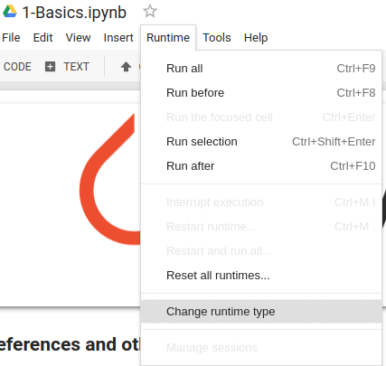

# PyTorch Tutorial
Original github repo [here](https://github.com//ahug/amld-pytorch-workshop/)

## Questions & Polls
**Link**: https://www.sli.do/ <br />
**Code**: AMLD
<br /><br />


## Binder (preferred)
[](https://mybinder.org/v2/gh/ahug/amld-pytorch-workshop/master) 
<br />

## Google Colab
As an alternative to Binder, you can also use [Google Colaboratory](https://colab.research.google.com), 
though you should use Binder if possible.

### Using Google Colab
The Google Colab notebooks are available under:
- [1-Basics.ipynb](https://colab.research.google.com/github/ahug/amld-pytorch-workshop/blob/master/1-Basics.ipynb)
- [2-Autograd.ipynb](https://colab.research.google.com/github/ahug/amld-pytorch-workshop/blob/master/2-Autograd.ipynb)
- [3-Optimization.ipynb](https://colab.research.google.com/github/ahug/amld-pytorch-workshop/blob/master/3-Optimization.ipynb)
- [4-Modules.ipynb](https://colab.research.google.com/github/ahug/amld-pytorch-workshop/blob/master/4-Modules.ipynb)
- [5-CNN-LSTM.ipynb](https://colab.research.google.com/github/ahug/amld-pytorch-workshop/blob/master/5-CNN-LSTM.ipynb)
- [6-Transfer-Learning.ipynb](https://colab.research.google.com/github/ahug/amld-pytorch-workshop/blob/master/6-Transfer-Learning.ipynb)


In order to use Google Colab, you have to login using your Google account:


### Changing the runtime type
You can add GPU support on Google Colab by changing the runtime type as depicted below:


<br />

## During the Workshop
During the workshop, we _highly recommend_ to use **Binder** or **Google Colab**. 
If you want to run the notebooks again later, you can use the following setup using [Anaconda](https://www.anaconda.com/). Unfortunately, we won't have time to help you with your conda installation. 
<br /><br /><br /><br />

## Using conda
If you want to run the notebooks locally, you can use `conda`. The following instructions
should work on Linux/Mac OS, Windows might require slight adaptations.

### Step 1: Install conda
If you have not installed it yet, you can download it from [Anaconda (Python 3.6 version)](https://www.anaconda.com/download/#linux).

Verify that it is installed by running
```bash
conda -V
```

Make sure your conda installation is up-to-date:
```bash
conda update conda
```

### Step 2: Download repository and install environment
Now clone the repository:
```bash
git clone https://github.com/ahug/amld-pytorch-workshop.git
cd amld-pytorch-workshop
```

The available `conda` environments can be listed using
```bash
conda env list
```

Let's now create a new environment called _'amld-pytorch'_.
```bash
conda env create -f environments.yml
```


### Step 3: Activate/Deactivate the environment
After the environment has been created, you can **activate** it by
```bash
source activate amld-pytorch
```

Now start the Jupyter notebook by running
```bash
jupyter notebook
```

The environment can similarly **deactivated** by
```bash
source deactivate
```
